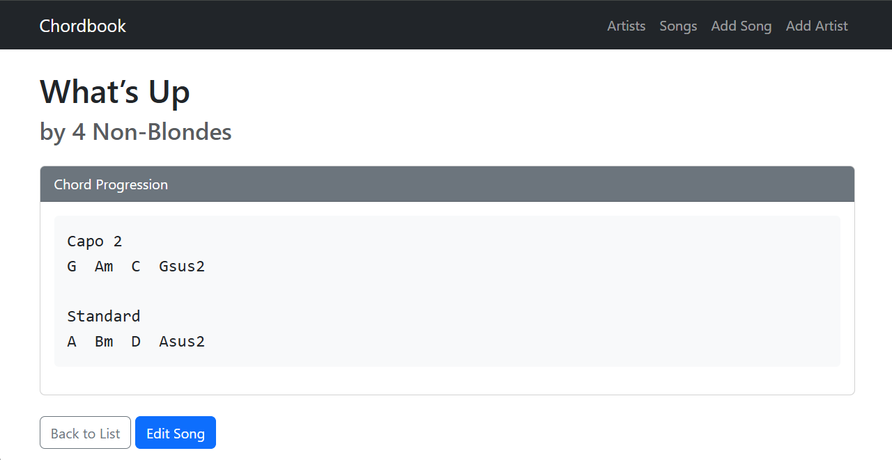

# Django Chordbook

A simple Django application for adding and displaying chord progressions for songs, organized by artist and title.

## Prerequisites

- Python 3.10+
- pip

## Installation

1. **Clone the repository:**
   ```bash
   git clone <repository-url>
   cd django-playground
   ```

2. **Create and activate a virtual environment:**
   ```powershell
   python -m venv .venv
   .\.venv\Scripts\activate
   ```

3. **Install dependencies:**
   ```powershell
   pip install -r requirements.txt
   ```

4. **Run migrations:**
   ```powershell
   python manage.py migrate
   ```

5. **Create a superuser (optional, for admin access):**
   ```powershell
   python manage.py createsuperuser
   ```

6. **Start the development server:**
   ```powershell
   python manage.py runserver
   ```
   The application will be available at `http://127.0.0.1:8000/`.

## Running Tests

To run the project's tests, use the following command:

```powershell
.\.venv\Scripts\python manage.py test
```

## Features

- **Artist Management**: Add and organize songs by artist.
- **Song Repository**: Store song titles and their chord progressions.
- **Clean UI**: Responsive design using Bootstrap.
- **Admin Interface**: Built-in Django admin for data management.

## Screenshots

### Song Detail View

